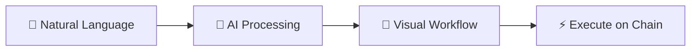

<div align="center">

# 🤖 agent8

### AI-Powered Cardano Workflow Automation

**Build blockchain workflows with natural language. Powered by AI.**

[Get Started](#-quick-start) · [Documentation](#-documentation) · [API Reference](API_DOCUMENTATION.md)


[](LICENSE)
[](https://www.typescriptlang.org/)
[](https://reactjs.org/)
[](https://fastapi.tiangolo.com/)

</div>

---

## 🌟 What is agent8?

agent8 is an **AI-powered workflow builder** for the Cardano blockchain. Simply describe what you want to do in natural language, and watch as AI generates a complete, executable workflow with visual nodes and connections.

### ✨ Key Features

- 🤖 **AI Workflow Generation** - Powered by Grok 2, completely free
- 🎨 **Beautiful Visual Editor** - Drag-and-drop workflow canvas
- 💼 **Cardano Integration** - Native support for wallets, DEX, NFTs, staking
- 🔄 **Real-time Updates** - See your workflow build in real-time
- 🌐 **Web Search** - AI searches the web for latest Cardano info
- 🎭 **Modern UI** - Lovable-inspired design with dark mode
- 🚀 **Zero Setup** - All API keys pre-configured for testing

### 🎯 Perfect For

- **Developers** building Cardano dApps
- **Traders** automating DeFi strategies
- **NFT Creators** streamlining minting workflows
- **Researchers** testing blockchain interactions
- **Anyone** exploring Cardano ecosystem

---

## 🎬 Demo

```bash
# Just ask in natural language:
"Swap 100 ADA for DJED on Minswap, then stake the rewards"
"Mint an NFT collection and list it on marketplace"
"Delegate to a stake pool and notify me when complete"
```

**The AI understands and builds complete workflows automatically!**

---

## 🏗️ How It Works

1. **Describe Your Goal** - Tell the AI what you want to do
2. **AI Generates Workflow** - Watch nodes appear in real-time
3. **Review & Edit** - Drag, connect, and customize nodes
4. **Execute** - Run the workflow on Cardano blockchain

<div align="center">



</div>

---

## 🚀 Quick Start

### Prerequisites

- **Node.js** v18+ and npm
- **Python** 3.9+ and pip
- **5 minutes** of your time ⏱️

> 💡 **Good News!** All API keys are pre-configured for testing. You can start immediately!

### ⚡ One-Command Setup

```bash
# Install frontend dependencies
npm install

# Install backend dependencies
cd backend && pip install -r requirements.txt && cd ..

# Run both (in separate terminals)
npm run dev              # Terminal 1: Frontend on :3000
python backend/main.py   # Terminal 2: Backend on :8000
```

### 🎉 That's It!

Open **http://localhost:3000** and start building workflows!

> 🔑 **API Keys Already Configured!** The app includes pre-configured API keys for testing:
> - ✅ OpenRouter (Grok 2) - FREE AI model
> - ✅ Perplexity - Web search
> - ✅ Google API - Future features
>
> For production, update keys in `backend/.env`

---

## 📝 Environment Variables

### Frontend (`.env.local`)
```bash
VITE_BACKEND_URL=http://localhost:8000
VITE_SOCKET_URL=http://localhost:8000
VITE_ENABLE_DEBUG=true
```

### Backend (`backend/.env`)
```bash
OPENAI_API_KEY=sk-your-key-here          # Required!
PERPLEXITY_API_KEY=pplx-your-key-here    # Optional
ALLOWED_ORIGINS=http://localhost:3000,http://localhost:5173
```

## 🛠️ Development

### Build for Production
```bash
npm run build
```

### Lint & Format
```bash
npm run lint      # Run ESLint (when configured)
npm run format    # Run Prettier (when configured)
```

### Testing
```bash
# Frontend tests (when configured)
npm test

# Backend tests
cd backend
pytest
```

## 🛠️ Tech Stack

<div align="center">

### Frontend
**React 19.2** · **TypeScript 5.8** · **Vite 6** · **TailwindCSS 3.4** · **Zustand** · **ReactFlow** · **Framer Motion** · **Mesh SDK**

### Backend
**FastAPI 0.115** · **Socket.IO** · **OpenRouter (Grok)** · **Perplexity** · **Python 3.9+**

### Blockchain
**Cardano** · **Mesh SDK** · **Multiple Wallet Support**

</div>

---

## 🔒 Security Notes

⚠️ **Important Security Information:**

- Never commit `.env` or `.env.local` files to git
- API keys should only be stored in backend environment variables
- CORS is configured for local development - update for production
- Rate limiting is recommended for production deployments

## 📖 Documentation

- [Codebase Analysis](tmp_rovodev_CODEBASE_ANALYSIS.md) - Detailed technical analysis
- [Implementation Plan](PLAN.md) - Development roadmap and progress

## 🤝 Contributing

Contributions are welcome! Please read our contributing guidelines before submitting PRs.

## 📄 License

[Your License Here]

## 🆘 Troubleshooting

### "Cannot find module" errors
```bash
npm install
```

### Backend won't start
- Ensure Python 3.9+ is installed
- Check that `OPENAI_API_KEY` is set in `backend/.env`
- Try: `pip install -r requirements.txt --upgrade`

### Frontend can't connect to backend
- Ensure backend is running on port 8000
- Check CORS configuration in `backend/main.py`
- Verify `VITE_SOCKET_URL` in `.env.local`

### Wallet won't connect
- Ensure you have a Cardano wallet extension installed
- Check browser console for errors
- Try refreshing the page

## 📞 Support

For issues and questions, please open a GitHub issue or contact the development team.

---

**Status:** 🚧 In Active Development
**Version:** 0.1.0

## 🎨 UI/UX Features

- **Lovable-Inspired Design** - Beautiful, modern interface
- **Centered Chat Experience** - Clean, focused start screen
- **Smooth Animations** - Framer Motion powered transitions
- **Dark Mode Native** - Optimized for dark theme
- **Responsive Design** - Works on mobile, tablet, desktop
- **Real-time Feedback** - See workflows build live
- **Gradient Accents** - Beautiful blue-to-purple theme

---

## 🚀 What Makes agent8 Special?

### 💰 Completely Free AI
- No OpenAI API costs
- Free Grok 2 model via OpenRouter
- Unlimited workflow generation

### ⚡ Lightning Fast
- Real-time workflow generation
- Instant visual feedback
- Smooth 60fps animations

### 🎯 Purpose-Built for Cardano
- Native DEX integration
- NFT minting support
- Staking workflows
- Smart contract execution

### 🎨 Beautiful UX
- Lovable-inspired design
- Centered chat interface
- Smooth animations
- Professional feel

---

## 📸 Screenshots

### Start Screen
Beautiful centered chat interface with example prompts

### Workflow Canvas
Visual node-based workflow editor with drag-and-drop

### Real-time Generation
Watch as AI builds your workflow step-by-step

---

## 🤝 Contributing

Contributions are welcome! Please read our [Contributing Guide](CONTRIBUTING.md) for details.

---

## 📄 License

MIT License - see [LICENSE](LICENSE) file for details

---

## 🙏 Acknowledgments

- **OpenRouter** - Free AI model access
- **Cardano Community** - Inspiration and support
- **Lovable** - Design inspiration
- **Mesh SDK** - Cardano integration

---

## 📞 Support

- 📚 [Documentation](API_DOCUMENTATION.md)
- 🐛 [Issue Tracker](https://github.com/yourusername/agent8/issues)
- 💬 [Discussions](https://github.com/yourusername/agent8/discussions)

---

<div align="center">

**Built with ❤️ for the Cardano ecosystem**

[⭐ Star on GitHub](https://github.com/yourusername/agent8) · [🐦 Follow on Twitter](https://twitter.com/agent8_ai)

</div>

